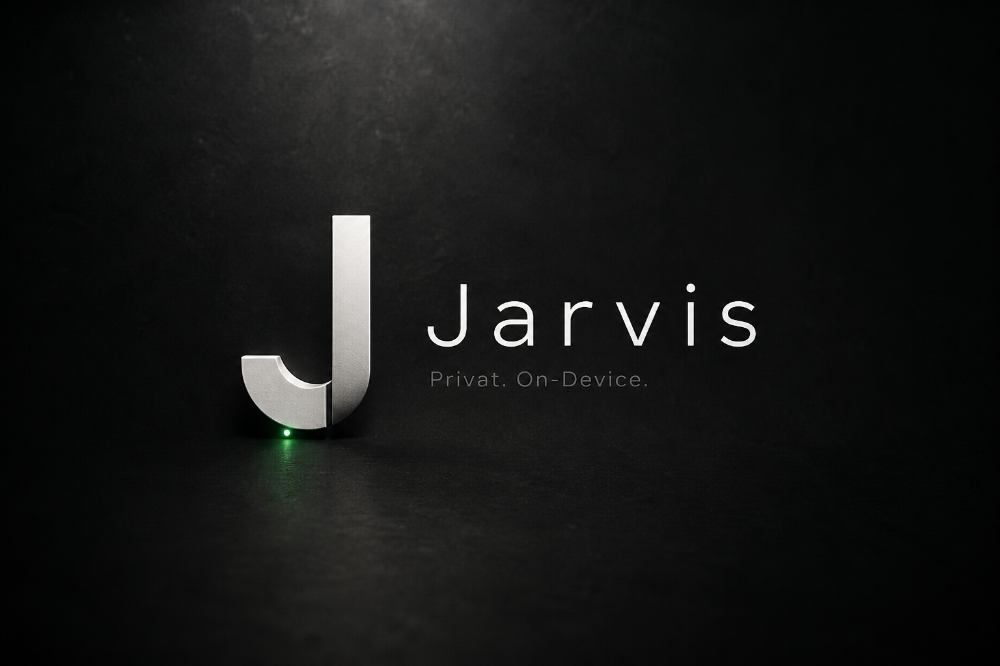

# Jarvis — On-Device

<p align="center">
  
</p>

Privater Assistant. Läuft **auf dem Handy**. PC-Steuerung über die Windows-App `desktop/JarvisPC.bat` im selben WLAN — nicht über NAS/Docker.

## Start (Dev-PC, nur zum Bauen)

```bash
cd frontend
npm install
npm run dev
```

Browser: http://localhost:5173 — einmal „Modell herunterladen“ (~470 MB).

## Android-APK

**`Jarvis.apk` `2.21.0`:** [Download](https://github.com/Gamerio2904/Jarvis/raw/cursor/on-device-iq-sprints-5517/releases/Jarvis.apk) (versionCode 22100).

Testprompts: Einstellungen → Tests, ankreuzen, Test starten. Debug-Chat ohne Tastatur, Download nach Downloads. Chat ohne Chips. API-Keys unter Einstellungen → APIs (eigener Bereich). Rabatt-Suche unter Einstellungen → Rabatt.

```bat
build-apk.bat
```

APK: `releases/Jarvis.apk`

1. Installieren (unbekannte Quellen).
2. App öffnen → Modell laden (WLAN).
3. Chat. Daten bleiben auf dem Gerät (IndexedDB).

Modell: Qwen2.5 0.5B Instruct Q4 (kleiner als der alte PC-7b, dafür offline).

Als Nächstes: optionales 1.5B `2.2.4` SHOULD — [`docs/30-next.md`](docs/30-next.md). Welt-Reihe ist in `2.19.0` **CODE** — [`docs/31-next.md`](docs/31-next.md).

## Was weg ist

Fernseher, Fire TV, Ventilator und WLAN-Steckdosen laufen in der Android-App.

Planung: [`docs/README.md`](docs/README.md)
