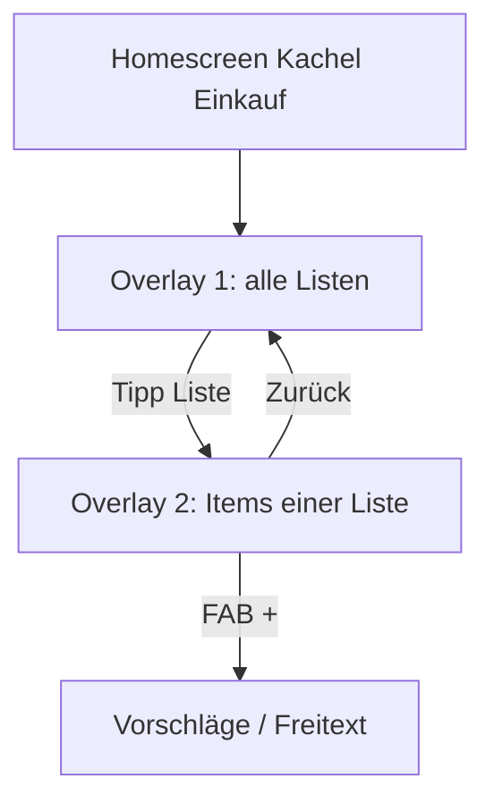

# Einkaufslisten-GUI (Mehrere Listen)

Plan nach [`plan-vorlage.md`](./plan-vorlage.md). **Umgesetzt** in App-Code **`18.25.14`** (Sprints S431–S437). Test: [`TEST-18.25.14.md`](./TEST-18.25.14.md).

## Bedingung

Die Einkaufsliste soll überarbeitet werden. Sie bekommt eine eigene GUI auf dem Niveau von Homescreen, Kalender und Filme. Ein neuer Shortcut auf dem Startbildschirm zeigt alle Einkaufslisten. Standardmäßig landet jedes Item in der ersten Hauptliste. Der Mensch kann eigene Listen anlegen (z. B. Urlaub, Amazon) und gezielt eintragen (z. B. „Airpods zur Amazon-Liste“). Beim Öffnen einer Liste kommt ein zweites Overlay: Produkte untereinander, mit Bild und Preis, in langen Karten wie die Projekt-Kacheln auf der Tischplatte (`workbench-card`). Wischen nach **links** hakt ab (Karte halbtransparent, nach unten sortiert; oben nur Offene). Wischen nach **rechts** löscht die Zeile. Unten rechts ein Button zum Hinzufügen: Name tippen, Vorschläge wählen, zur aktuellen Liste legen.

## Rahmen dieses Projekts

Die Rahmen der Vorlage gelten. Dazu, enger:

1. **Keine erfundenen Preise oder Produktbilder.** Bild und Preis nur, wenn eine angebundene Quelle sie liefert; sonst Platzhalter und ehrlicher Text (wie bei Research und Open Food Facts).
2. **Hausstand.** Listen und Items gehören in Export/Import und Kopplung wie Termine und Filme (`backup.ts`).
3. **Sprache bleibt.** Parser und Agent `shopping` werden erweitert, nicht ersetzt; Chat und GUI teilen dieselbe Store-Schicht.
4. **Kein Shop-Kauf.** Kein Amazon-Checkout, kein Alexa-Kauf (Entscheidung Q32). Listen sind Merkzettel, optional mit Preisinfo aus Suche.
5. Diese Planung schreibt keinen Code, keine Version und kein APK.

## Ist-Stand (Code)

| Bereich | Heute |
|--------|--------|
| Daten | Eine flache IndexedDB-Tabelle `shopping`: `ShoppingItem` mit `title`, `status` `open`/`got`, Zeiten, optional `source_conversation_id` ([`store.ts`](../frontend/src/engine/store.ts)) |
| Sprache | [`shopping-parse.ts`](../frontend/src/engine/shopping-parse.ts) — add/list/got/clear, keine Listennamen |
| Handler | [`shopping.ts`](../frontend/src/engine/shopping.ts) — alles auf eine globale Liste |
| UI | Kein Overlay; nur Glance-Zeile „Einkauf“ in [`GlanceRail.tsx`](../frontend/src/ui/GlanceRail.tsx) |
| Homescreen | Kein Icon; [`home-apps.ts`](../frontend/src/engine/home-apps.ts) kennt `shopping` nicht |
| Design-Anker | Vollbild-Overlays wie [`WatchlistOverlay.tsx`](../frontend/src/ui/WatchlistOverlay.tsx); Karten wie `.workbench-card` in [`index.css`](../frontend/src/index.css) / Tischplatte |

## Quellen

| Quelle | Adresse | Inhalt |
|--------|---------|--------|
| Open Food Facts | `https://world.openfoodfacts.org` | Suche, Bild-URL, Produktname — bereits für Lebensmittel in [`food.ts`](../frontend/src/engine/food.ts) |
| Research / Produkt | [`research-parse.ts`](../frontend/src/engine/research-parse.ts) `isProductLookup` | Optional Preis-Hinweise, wenn `shop_discount` an und Gemini/Research — **nur** zitierte Werte, kein Raten |

Weitere Katalog-APIs (Amazon, MediaMarkt, …) sind **Lücken**, bis jemand `Such …` mit Lizenz und API nennt.

## Anforderungen

| ID | Satz | Abnahme | Gateway |
|----|------|---------|---------|
| A1 | Mehrere benannte Listen, eine feste Hauptliste. | Beim ersten Start existiert genau eine Liste „Hauptliste“ (oder „Einkauf“). Alle bisherigen `shopping`-Items hängen daran. Neue Items ohne Listennamen → Hauptliste. | offen |
| A2 | Homescreen-Shortcut öffnet Listen-Übersicht. | Kachel „Einkauf“ (oder „Listen“) neben Kalender/Filme; Tipp öffnet Overlay Ebene 1; `Fertig` schließt wie Watchlist. | offen |
| A3 | Listen-Detail als zweites Overlay. | Tipp auf eine Liste öffnet Ebene 2 über Ebene 1; Zurück zur Übersicht ohne alles zu schließen. | offen |
| A4 | Item-Karten wie Tischplatten-Projekte. | Gleiche visuelle Familie: `.workbench-card` / Portfolio-Wand — Glas, Radius, Typo wie `18.25`; Thumbnail links, Titel + Preis rechts. | offen |
| A5 | Wischen links = erledigt. | Abgehakt: `opacity` reduziert, Status `got`, Sortierung unten; offene Items oben. Kein zweites Bestätigungs-Dialog. | offen |
| A6 | Wischen rechts = löschen. | Item verschwindet aus Store und UI; optional kurze Undo-Leiste (Could, nicht Must). | offen |
| A7 | Hinzufügen unten rechts. | FAB; Sheet mit Suchfeld; debounced Vorschläge; Tipp auf Vorschlag legt Item in **aktuelle** Liste. | offen |
| A8 | Sprache mit Listennamen. | „Milch auf die Einkaufsliste“ → Hauptliste; „Airpods zur Amazon-Liste“ → Liste `Amazon` (anlegen wenn neu); Synonyme `Liste`, `Einkaufsliste`. | offen |
| A9 | Hausstand & Glance. | Backup enthält Listen + Items; Glance zeigt z. B. „3 offen · Hauptliste“ oder Summe offener Items. | offen |

## Entscheidungen

| ID | Schnitt | Grund | Gateway |
|----|---------|-------|---------|
| E1 | Zwei Overlays statt einer Ebene mit Tabs. | Bedingung: Übersicht aller Listen, dann eigenes Overlay pro Liste. | go |
| E2 | Links = erledigt, rechts = löschen. | Bedingung nennt Löschen explizit „nach rechts“; links = abhaken (Watchlist/Kalender-Konsistenz). | go |
| E3 | Hauptliste ist `is_default: true`, nicht löschbar. | Standardziel für Parser und Migration; Umbenennen erlaubt. | go |
| E4 | Produktvorschläge: OFF zuerst, Research optional. | Lebensmittel über Open Food Facts (Bild aus API); Elektronik/Amazon-Liste oft nur Freitext + Platzhalter-Bild, Preis leer bis Research liefert Zitat. | go |
| E5 | Listen-ID stabil in Store; Anzeigename editierbar. | „Amazon-Liste“ per Sprache = slug `amazon`, Anzeige „Amazon“. | go |
| E6 | Kein WebGL, keine fremden Shop-Embeds. | Wie Tischplatte/Portfolio — native React + CSS. | go |

## Datenmodell (Ziel)

Neue Tabelle `shopping_lists` (oder Präfix in Store):

```ts
ShoppingList: {
  id: string
  name: string           // Anzeige
  slug: string           // normalisiert für Parser
  is_default: boolean
  created_at, updated_at
}

ShoppingItem: {
  id, list_id, title, status: 'open' | 'got'
  image_url?: string
  price_text?: string    // zitiert, z. B. "12,99 €"
  price_source?: string  // optional URL/Quelle
  product_ref?: string   // OFF code, etc.
  sort_open: number      // Reihenfolge offen
  sort_done: number      // Reihenfolge erledigt
  …
}
```

Migration beim ersten Lesen: eine Default-Liste, alle alten Items → `list_id` = default.

## UI-Skizze



**Overlay 1:** Kopf „Einkaufslisten“, `Fertig`, Raster oder vertikale Karten je Liste (Name, Anzahl offen, letztes Item). Button „Neue Liste“. **Overlay 2:** Kopf = Listenname, Liste der Item-Karten, FAB unten rechts.

## Sprints

Nummern **431–437** (folgen auf Sprint 430 in [`42-planned.md`](./42-planned.md)).

### S431 — Store, Migration, APIs

**Ziel:** Mehrere Listen im Hausstand, alte Daten sicher.

**Anforderungen:** A1, A9 (Store-Teil).

**Lieferumfang:**

- S431-1. `shopping_lists` + erweitertes `ShoppingItem`, Migration, CRUD (`createList`, `addItem`, `toggleGot`, `removeItem`, `renameList`).
- S431-2. Backup/Restore und Event `jarvis-shopping` für UI-Refresh.
- S431-3. Unit-Skript `test-shopping-lists.mjs` (Migration, default list, dedupe Titel pro Liste).

**Gateway:** `go` wenn Migration idempotent und Backup roundtrip. **No-Go:** Items ohne `list_id`. **Abbruch:** Migration bricht bei korruptem JSON — dann alte Single-Liste behalten und Fehler zeigen. **Hängt an:** nichts.

---

### S432 — Homescreen + Overlay 1

**Ziel:** Shortcut und Listenübersicht.

**Anforderungen:** A2.

**Lieferumfang:**

- S432-1. `home-apps.ts`: `shopping` + Glyph (Tüte/Einkaufswagen), Farbe Alltag-Grün.
- S432-2. `ShoppingListsOverlay.tsx`: Modal wie Watchlist (`useOverlay`, `fx-in`, `Fertig`).
- S432-3. `App.tsx`: State `shoppingOpen`, Back-Stack, DebugChatDock `overlayOpen` ergänzen.

**Gateway:** `go` wenn Kachel auf Phone und Tablet erreichbar. **Hängt an:** S431.

---

### S433 — Overlay 2 + Kartenlayout

**Ziel:** Detailansicht mit Tischplatten-Optik.

**Anforderungen:** A3, A4.

**Lieferumfang:**

- S433-1. `ShoppingListDetailOverlay.tsx` — Props `listId`, nested über Overlay 1.
- S433-2. CSS-Modul oder Klassen `shop-card` abgeleitet von `.workbench-card`; Platzhalter-Bild wenn kein `image_url`.
- S433-3. Sortierung: offen oben (`sort_open`), erledigt unten halbtransparent.

**Gateway:** `go` wenn zwei Ebenen navigierbar. **Hängt an:** S432.

---

### S434 — Wischgesten

**Ziel:** Abhaken und Löschen per Geste.

**Anforderungen:** A5, A6.

**Lieferumfang:**

- S434-1. Wiederverwendung Swipe-Pattern aus Watchlist/Kalender (pointer events, Schwellwert px, reduced motion = Buttons sichtbar).
- S434-2. Links → `markGot`; Rechts → `deleteItem`; Animation und sofortiges Persist.
- S434-3. Tests: Skript simuliert Store-Transitions (kein Browser nötig).

**Gateway:** `go` wenn Gesten auf Android flüssig (PO-Gerät). **No-Go:** nur Maus-Desktop ohne Touch-Fallback. **Hängt an:** S433.

---

### S435 — Produkt hinzufügen + Vorschläge

**Ziel:** FAB-Flow mit Suche.

**Anforderungen:** A7, E4.

**Lieferumfang:**

- S435-1. Bottom-Sheet: Input, 300 ms Debounce, Trefferliste (OFF für Lebensmittel; sonst Titel-only-Zeile „Freitext übernehmen“).
- S435-2. Bei OFF-Treffer: `image_url`, `product_ref` speichern; Preis nur wenn API-Feld vorhanden.
- S435-3. Optional: ein Tap „Preis nachladen“ ruft **bestehende** Research-Produktkette nur mit explizitem Tap auf — nicht automatisch beim Hinzufügen.

**Gateway:** `go` wenn mindestens OFF-Suche + Freitext funktionieren. **Lücke:** Amazon-Katalog bleibt Freitext. **Hängt an:** S431, S433.

---

### S436 — Sprache & Parser

**Ziel:** Listennamen in Utterances.

**Anforderungen:** A8.

**Lieferumfang:**

- S436-1. `shopping-parse.ts`: `add` mit optional `listSlug` / `listName` („zur X-Liste“, „auf Amazon“).
- S436-2. `shopping.ts`: Ziel-Liste auflösen, Liste anlegen wenn erlaubt (Blacklist: leer, zu lang, Systemnamen).
- S436-3. `test-copy` / `test-prompts`: neue Zeilen für Hauptliste vs. benannte Liste; `conflicts.ts` unverändert außer bei Kollision mit `shop_discount`-Research.

**Gateway:** `go` wenn alte Prompts unverändert grün bleiben. **Hängt an:** S431.

---

### S437 — Glance, Tests, Feinschliff

**Ziel:** Alltag sichtbar, Abnahme dokumentiert.

**Anforderungen:** A9, A1–A8 Gesamt.

**Lieferumfang:**

- S437-1. `glance.ts` / GlanceRail: Summe offener Items, Link optional „Einkauf öffnen“.
- S437-2. [`TEST-18.25.md`](./TEST-18.25.md) oder neues `TEST-18.26-einkauf.md` mit PO-Schritten (GUI + 3 Sprachsätze).
- S437-3. Version in [`09-versioning.md`](./09-versioning.md) erst bei `Umsetzen` + APK — nicht in diesem Plan.

**Gateway:** `go` wenn S431–S436 `go`. **Projekt-Gateway:** `go` wenn alle Sprints `go` oder Lücken (Amazon-Katalog) benannt bleiben.

## PSP (kurz)

| Schritt | Wer | Was |
|---------|-----|-----|
| PO | Mensch | Gesten auf Gerät prüfen, Listennamen auf Deutsch |
| Dev | Agent | S431→S437 nacheinander, je Sprint Commit + Test |
| Abnahme | PO | [`TEST`](./TEST-18.25.md)-Erweiterung grün, Backup import/export |

## Risiken

| Risiko | Mitigation |
|--------|------------|
| OFF ohne Bild für Markenprodukte | Platzhalter-Icon; Freitext trotzdem speichern |
| Research-Preis widerspricht Ladenpreis | `price_source` anzeigen; kein „aktueller Preis“ ohne Quelle |
| Viele Listen, kleines Display | Overlay 1 scroll; Suche in Overlay 1 (Could) |
| Swipe vs. Scroll | Horizontaler Swipe auf Karte; vertikal scrollt Liste |

## Schnittstellen

- `App.tsx` / `HomeScreen.tsx` — neuer App-Id-Zweig wie `watchlist`.
- `backup.ts` — Schema-Version bump wenn nötig (`shopping_lists` Array).
- `agents/execute-map.ts` — unverändert, Handler intern.
- `Widget` (falls später) — kann offene Anzahl aus S437 lesen.

## Lücken

1. **Amazon / Elektronik-Katalog** — keine offene API im Repo; Airpods-Eintrag = Name + optional manuelles Bild, kein Auto-Preis.
2. **Undo nach Löschen** — nicht in Bedingung; Could in S434.
3. **Gemeinsame Liste zwischen gekoppelten Geräten** — erst mit [`hausstand-sync-plan.md`](./hausstand-sync-plan.md) / Kopplung; hier nur lokaler Hausstand.

## Projekt-Gateway

**Go wenn:** S431–S437 abgenommen, Build grün, keine erfundenen Preise in UI.

**No-Go wenn:** Single-Liste-Regression in Parser oder Backup bricht.

**Umsetzen:** nur Sprints mit Gateway `go`, in Reihenfolge S431 → S437.

## Prompt (Umsetzen)

„Baue S431 aus [`einkaufsliste-plan.md`](./einkaufsliste-plan.md): Mehrere Einkaufslisten im Store, Migration von der flachen Liste, Backup. Noch keine GUI.“

Danach jeweils nächster Sprint bis S437.
